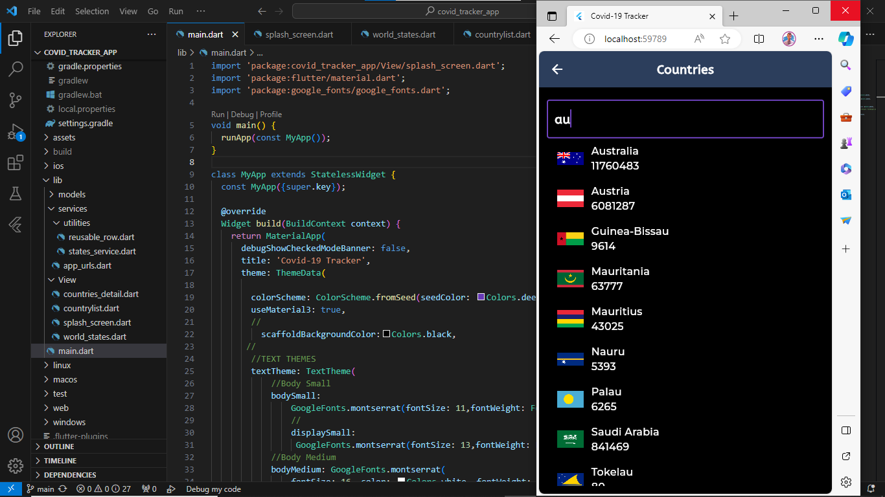

# COVID-19 Tracker App

## Overview

Welcome to the Covid-19 Tracker App, your go-to tool for staying informed about the latest developments in the global fight against the COVID-19 pandemic. This app provides live data on confirmed cases, deaths, and recoveries, empowering you with real-time information to make informed decisions.

## Features

- **Live Data:** Get up-to-the-minute updates on the current number of Covid-19 cases, deaths, and recoveries worldwide.

- **Global Stats:** Track the pandemic's impact on different countries with detailed statistics for each nation.

- **User-Friendly Interface:** Our intuitive design makes it easy for users of all levels to navigate and access critical information effortlessly.

- **Graphical Representation:** Visualize data trends over time with interactive charts, allowing for a comprehensive understanding of the situation.

- **Customizable Alerts:** Set personalized notifications for specific countries or regions, ensuring you are instantly alerted to changes in the situation that matter most to you.

## How to Use

1. **Installation:**
   - Clone the repository.
   - Install dependencies using `npm install` or `yarn install`.

2. **Explore the Features:**
   - Browse global statistics.
   - Search and select specific countries for detailed insights.
   - Receive live updates on the status of the pandemic.

## Contributions

We welcome contributions from the community to enhance the app's functionality, user experience, and data accuracy. If you have ideas, bug fixes, or new features to propose, feel free to submit a pull request.

## Screenshots

